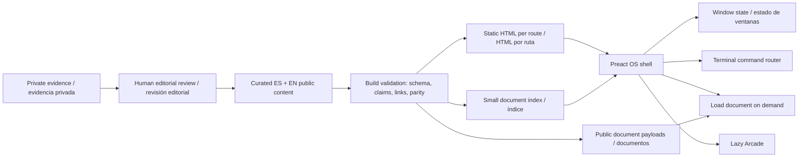

# AntonioOS — auditoría y plan / audit and implementation plan

Fecha / Date: **2026-09-10**. Estado / Status: **M0, revisión previa a implementación / pre-implementation review**.

## 1. Dictamen / Assessment

**ES.** Recomiendo continuar sobre la base local Astro + TypeScript + Preact, conservar Flutter como archivo histórico y completar el portfolio por incrementos. Ya hay un gestor de ventanas funcional: reconstruirlo desde cero desperdiciaría trabajo existente. La web todavía no cumple la misión en contenido, acceso inmediato al posicionamiento, arquitectura, contacto, CV final ni preparación reproducible del despliegue. No debe publicarse como portfolio terminado.

**EN.** Continue from the local Astro + TypeScript + Preact foundation, retain Flutter as a historical archive, and complete the portfolio incrementally. A functioning window manager already exists; rebuilding it would discard useful work. Content, immediate professional positioning, architecture, contact, the final CV and reproducible deployment readiness still fall short of the mission. This is not ready to publish as the completed portfolio.

**ES.** Esta ejecución solo audita y propone. No cambia código, dependencias, configuración, contenido público, ramas ni despliegue. Se han regenerado artefactos locales de diagnóstico/build/tests; este documento es el único archivo de entrega añadido al repositorio. La instrucción de detenerse y esperar aprobación procede expresamente de la sección 28 de la misión.

**EN.** This execution audits and proposes only. It changes no code, dependencies, configuration, public content, branches or deployment. Local diagnostic/build/test artifacts were regenerated; this document is the only delivery file added to the repository. The stop-and-wait gate comes explicitly from section 28 of the mission.

## 2. Qué se ha auditado / Audit scope and provenance

| Objeto / Object | Evidencia y alcance / Evidence and scope |
|---|---|
| Repositorio / Repository | `xenxi/antoniomdm.dev`; local HEAD y remote main / local HEAD and remote main: `aa2e5207656b66456cd2886307a291cba9b125b6`. |
| Árbol local / Local tree | Migración Astro y traducciones sin commit, ya presentes al comenzar / Astro migration and translations were uncommitted and already present at the start. |
| Histórico / Historical source | `legacy/flutter/pubspec.yaml`, lock, `.metadata`, `lib/`, `test/`, `assets/`, `web/`, Android/iOS y workflow de HEAD / Android/iOS and HEAD workflow. |
| Web actual / Current web | `src/os`, `components`, `data`, `i18n`, `arcade`, `styles`, layouts/pages/content; configuración, scripts, tests, assets públicos y documentación / configuration, scripts, tests, public assets and documentation. |
| Conservación / Preservation | `node scripts/verify-legacy.mjs`: **137** archivos idénticos por hash Git normalizado / identical files using normalized Git blob hashes. |
| Fuente profesional / Career source | Lectura autenticada de GitHub, sin copiar el vault al repo público / authenticated GitHub reads, without copying the vault into the public repository. Revision: `3fd3d28c945c348f8f0329589d6bfdce4a88e89a`, comprobada antes y después / checked before and after. |
| Producción / Production | GitHub Pages: `gh-pages`, `/`, CNAME `antoniomdm.dev`, HTTPS enforced, status `built`. El dominio aún sirve Flutter / the domain still serves Flutter. |
| QA | Chromium automatizado, HTML estático, capturas inspeccionadas y Lighthouse / automated Chromium, static HTML, inspected screenshots and Lighthouse. |

**ES.** Los borrados que muestra `git status` en rutas Flutter corresponden a la migración local existente; no son borrados realizados en esta auditoría. No se hizo `reset`, `clean`, checkout, commit, push ni staging. La consulta de Actions devolvió cero ejecuciones recientes, por lo que no hay evidencia de un pipeline Astro remoto correcto. `Pages: built` acredita un sitio publicado, no la nueva versión.

**EN.** Deleted Flutter paths in `git status` belong to the pre-existing local migration, not this audit. No reset, clean, checkout, commit, push or staging was performed. The Actions query returned no recent runs, so it provides no evidence of a successful remote Astro pipeline. `Pages: built` confirms an existing published site, not the new version.

Documentación previa / Previous documentation: [legacy audit](LEGACY_AUDIT.md), [architecture](ANTONIOMDM_OS_ARCHITECTURE.md), [M1 delivery](M1_DELIVERY.md), [bilingual guide](BILINGUAL_CONTENT.md). **ES:** son antecedentes, no resultados de esta ejecución: mencionan 16 tests, 14 páginas y contenido pendiente que ya ha cambiado. **EN:** these are historical records, not this run's results: their 16 tests, 14 pages and content backlog no longer describe the current tree.

### Fuentes profesionales leídas / Career sources read

Todos los paths siguientes pertenecen a `knowledge-vault/career/` / All paths below are relative to `knowledge-vault/career/`:

- `README.md`
- `master/profile.md`
- `master/evidence-matrix.md`
- `master/cv-master.md`
- `master/gaps-career-path.md`
- `experience/domingo-alonso.md`
- `experience/anexia.md`
- `experience/vector-itc.md`
- `experience/alcatel-nokia.md`
- `experience/early-career.md`
- `projects/platform934.md`
- `cv/cv-a-software-architect-dotnet.md`
- `cv/cv-a-software-architect-dotnet-layout.md`

**ES.** `profile` y `cv-master` son working masters; CV A es `DRAFT_V2_ES`, y layout es un plan. Ninguno es un PDF final aprobado. La matriz ayuda a clasificar, pero no concede por sí sola visibilidad pública a todas sus notas. Se cruzan sus afirmaciones con secciones `CV_SAFE` y formulaciones explícitamente destinadas a publicación. Los documentos de gaps se usan exclusivamente para evitar sobreafirmaciones.

**EN.** `profile` and `cv-master` are working masters; CV A is `DRAFT_V2_ES`, and the layout is a plan. None is an approved final PDF. The matrix helps classify evidence but does not make all its notes public. Claims must be cross-checked against `CV_SAFE` sections and explicit public-output wording. Gap documents are used only to prevent overclaiming.

## 3. Auditoría Flutter / Flutter audit

### SDK y dependencias / SDK and dependencies

| Dato / Item | Resultado / Result |
|---|---|
| Manifest | `amdiaz`, `1.0.0+1`; Dart `>=2.16.0-134.1.beta <3.0.0`. |
| Lock | Dart `>=2.18.0 <3.0.0`, Flutter `>=3.0.0`; `sky_engine` locked at `0.0.99`. |
| Metadata | Beta revision `628f0e3f3a01d6e6b5fd8c2d7b8f0d58883b6673`; no release exacta reproducible / no reproducible exact release pin. |
| CI histórica / Historical CI | Canal beta sin versión fija / unpinned beta channel, `checkout@v2`, `flutter-action@v1`, `flutter-gh-pages@v7`. |
| SDK instalado / Installed SDK | **Flutter 3.47.1 stable**, revision `6655482ec0`; **Dart 3.13.1**, DevTools 2.60.0. |
| Objetivo recomendado / Recommended target | Producción: conservar Astro 7.3.2 y Preact 10.29.8. Flutter: sin actualización para la web actual / Production: retain Astro 7.3.2 and Preact 10.29.8. No Flutter upgrade for the current web. |
| Si se decide revivir Flutter / If Flutter revival is approved | Spike aislado sobre 3.47.1/Dart 3.13.1, fijado y disponible localmente; revisar patch estable 3.47.2 antes de formalizar soporte / isolated spike using the installed, pinned SDK; review stable patch 3.47.2 before committing to support. |
| Diagnóstico aislado / Isolated diagnostic | `flutter pub outdated --json` sobre copias de manifest/lock fuera del repo falla: SDK `sky_engine` ofrece `0.0.0`, lock solicita `0.0.99` / copied manifests outside the repository fail because SDK and locked `sky_engine` versions differ. |

**ES.** No se ejecutó una actualización masiva ni se cambió el lock histórico. El fallo anterior impide obtener una matriz completa de versiones resolubles con ese lock; no demuestra que todas las dependencias sean incompatibles. `flutter analyze`, `flutter test` y `flutter build web` no se ejecutaron: Flutter no es el producto actual y no se preparó una copia completa con dependencias resueltas. No se presentan como aprobados.

**EN.** No bulk upgrade or historical lock change was made. The diagnostic failure prevents a complete resolvable-version matrix with that lock; it does not prove every dependency incompatible. Flutter analyze/test/build were not run: Flutter is not the current product, and a full dependency-resolved copy was not prepared. These checks are not reported as passing.

**ES.** No basta con ver `<3.0.0` para declarar incompatibilidad con Dart 3: Pub admite una reinterpretación de ese límite para paquetes null-safe cuyo mínimo sea 2.12 o posterior. Sí hay APIs eliminadas en el código: `headline1`, `headline2`, `subtitle1`, `bodyText1`, además de navegación y audio antiguos que requieren revisión. [Dart 3 migration](https://dart.dev/resources/dart-3-migration), [Flutter TextTheme migration](https://docs.flutter.dev/release/breaking-changes/3-19-deprecations).

**EN.** A `<3.0.0` upper bound alone does not establish Dart 3 incompatibility: Pub can reinterpret it for null-safe packages with a minimum of 2.12 or later. The source does use removed APIs, including `headline1`, `headline2`, `subtitle1` and `bodyText1`; old navigation and audio APIs also require review. See the migration references above.

Versiones consultadas en la API oficial de [pub.dev](https://pub.dev/) el 10-09-2026 / Versions checked against the official pub.dev API on 2026-09-10. **Latest no significa compatible ni objetivo aprobado / Latest does not mean compatible or approved.**

| Paquete / Package | Lock | Latest consultada / observed | Tratamiento propuesto / Proposed treatment |
|---|---:|---:|---|
| animate_do | 3.0.2 | 5.1.0 | CSS; revisar salto mayor si Flutter / review major upgrade if reviving Flutter. |
| animated_text_kit | 4.2.2 | 4.3.0 | Texto inmediato + motion opcional / immediate text + optional motion. |
| cupertino_icons | 1.0.5 | 1.0.9 | SVG propio / owned SVG. |
| dartz | 0.10.1 | 0.10.1 | Uniones tipadas / typed unions. |
| equatable | 2.0.5 | 2.1.0 | Estado inmutable TS / immutable TS state. |
| fluro | 2.0.4 | 2.0.5 | Rutas Astro + History API / Astro routes + History API. |
| flutter_bloc | 8.1.1 | 9.1.1 | Reducer actual; migración coordinada con bloc_test si Flutter / current reducer; coordinated bloc_test migration if Flutter. |
| flutter_hooks | 0.18.5+1 | 0.21.3+1 | Preact hooks; revisar lifecycle/dispose / review lifecycle/disposal. |
| font_awesome_flutter | 10.3.0 | 11.0.0 | SVG sin fuente completa / SVG without full icon fonts. |
| github | 9.9.0 | 9.26.0 | Contenido estático sin token cliente / static content without client tokens. |
| intl | 0.18.0 | 0.20.3 | `Intl.DateTimeFormat`; revisar restricciones del SDK si Flutter / review SDK constraints if Flutter. |
| just_audio | 0.9.31 | 0.10.6 | Audio nativo opcional / optional native audio. |
| url_launcher | 6.1.8 | 6.3.2 | Anchors HTML; si Flutter, revisar `launchUrl` / if Flutter, review launchUrl. |
| bloc_test | 9.1.0 | 10.0.0 | Vitest para dominio / Vitest for domain. |
| flutter_lints | 2.0.1 | 6.0.0 | ESLint + Astro check. |
| mocktail | 0.3.0 | 1.0.5 | Vitest/Playwright. |
| flutter / flutter_test | SDK | SDK | Solo archivo histórico / archive only. |

### Arquitectura histórica / Historical architecture

**ES.** `domain/` contiene contratos de Posts/MusicPlayer, Post y Failure; `infrastructure/` adapta GitHub y just_audio; `application/engine_mode` gestiona modo, encendido y música; `presentation/` compone layouts/widgets/vistas; `shared/` contiene valores y widgets. La separación conceptual es útil y debe conservarse en la nueva arquitectura, aunque los widgets no se puedan reutilizar en DOM.

**EN.** `domain/` contains Posts/MusicPlayer contracts, Post and Failure; infrastructure adapts GitHub and just_audio; application/engine_mode owns mode, power and music; presentation composes layouts/widgets/views; shared holds values and widgets. Preserve these conceptual boundaries in the new architecture even though Flutter widgets cannot render directly in the DOM.

**ES.** MaterialApp + Fluro solo definen inicio, experiencia y blog. `MainLayoutBuilder` usa un Overlay y alterna Windows/Arcade alrededor del mismo contenido. El layout Windows tiene **un único modal**: cerrar y minimizar hacen lo mismo, no existen instancias independientes, orden Z real, reapertura por tarea ni límites de arrastre. El tamaño maximizado resta una barra fija de 50 px. El draggable permite sacar contenido de pantalla y no ofrece alternativa de teclado.

**EN.** MaterialApp + Fluro define only home, experience and blog. MainLayoutBuilder switches Windows/Arcade around the same routed content through an Overlay. Windows has **one modal**: close and minimize share behavior, without independent instances, real Z-order, per-task restoration or drag bounds. Maximization subtracts a fixed 50 px bar. Dragging can move content offscreen and has no keyboard alternative.

**ES.** La experiencia usa texto de relleno y entradas incompletas. El blog depende de GitHub en runtime; navega a detalles no registrados, incluye un segundo `return` inalcanzable y muestra loader también ante errores. El test de Posts requiere red/repositorio/token; no es una prueba aislada. Los tests restantes cubren nombre, construcción, modo y audio, no lifecycle de múltiples ventanas, SEO, privacidad ni responsive completo.

**EN.** Historical experience contains filler and incomplete entries. The blog depends on runtime GitHub access, links to unregistered detail routes, includes an unreachable second return, and displays loading for errors too. Its Posts test depends on a live repository/network/token. Other tests cover name, construction, mode and audio rather than multiwindow lifecycle, SEO, privacy or comprehensive responsiveness.

### Arcade histórico y actual / Historical and current Arcade

| Aspecto / Aspect | Flutter histórico / Historical Flutter | Web actual / Current web |
|---|---|---|
| Concepto / Concept | Carcasa de recreativa alrededor de la vista / arcade cabinet around routed content. | Launcher → ENTER → preview de destinos / destination preview. |
| Juego / Game | No hay motor, puntuación ni gameplay / no engine, score or gameplay. | No hay mapa caminable ni juego completo / no walkable map or complete game. |
| Interacción / Interaction | 12 botones decorativos cambian sprite durante ~200 ms / decorative buttons swap sprite for ~200 ms. | Destinos reales a proyectos, experiencia, notas y lab / real destinations into content apps. |
| Responsive | Breakpoint 720 px; recreativa 900×900 escalada, perspectiva en pantalla / scaled 900×900 cabinet and perspective. | Overlay de mundo, return/Escape, escritorio `inert` / world overlay, return/Escape, inert desktop. |
| Música / Music | Primera entrada programa reproducción tras 500 ms; control inicial desactivado / first entry schedules playback after 500 ms; initially disabled control. | Sound + music opt-in y Play explícito; pausa/liberación al salir / explicit opt-in and Play; pause/disposal on exit. |
| Carga / Loading | GIF, blur, fuentes y sprites; no frontera modular de app / GIF, blur, fonts and sprites; no app module boundary. | Import dinámico y WebP después de ENTER; MP3 después de Play / dynamic import and WebP after ENTER; MP3 after Play. |

**ES.** Mantener identidad y acceso opcional, el contrato actual y el límite de carga. No portar la carcasa Flutter como dependencia ni confundir la preview con un juego terminado. Propuesta inicial: Arcade como app con pantalla de lanzamiento y modo inmersivo explícito; la aprobación debe confirmar si se conserva este modo o se exige ejecución dentro de la ventana. Badges opcionales solo a partir de logros aprobados, sin convertirlos en nuevos claims.

**EN.** Preserve the optional identity, current contract and loading boundary. Do not introduce the Flutter cabinet as a dependency or describe the preview as a finished game. Proposed default: an Arcade app with a launch screen and explicit immersive mode; approval should confirm this mode versus running entirely inside the window. Optional badges must derive from approved achievements without adding new claims.

### Assets, SEO y CI histórica / Historical assets, SEO and CI

**ES.** Assets destacados: wallpaper `bg_03.png` 9.82 MB; `arcade.png` 3.57 MB; `arcade_without_buttons.png` 3.52 MB; MP3 2.18 MB; GIF principal 0.88 MB. El diseño usa fuentes Arcade/Radical/Edunline/Neon, texto verde/ámbar, neon/flicker, imágenes de fondo y blur. Puede conservarse como referencia; no es la identidad madura solicitada. La procedencia/licencia de estas imágenes, música y fuentes no está documentada.

**EN.** Notable assets: 9.82 MB wallpaper, 3.57/3.52 MB cabinet images, 2.18 MB MP3 and 0.88 MB main GIF. The design uses Arcade/Radical/Edunline/Neon fonts, green/amber text, neon/flicker, backgrounds and blur. It remains useful reference material but is not the requested mature identity. Image, music and font provenance/licenses are undocumented.

**ES.** `web/index.html` carece de contenido profesional semántico, `lang`, canonical y tarjetas sociales; conserva metadescripción genérica. El bootstrap espera al service worker y tiene fallback de cuatro segundos. El manifest bloquea orientación a portrait-primary. El bundle publicado `main.dart.js` pesa **2,315,459 bytes sin comprimir**; también solicita CanvasKit y múltiples fuentes.

**EN.** Historical HTML lacks semantic career content, language, canonical and social cards, and retains a generic description. Bootstrap waits for a service worker with a four-second fallback. The manifest requests portrait-primary orientation. Published main.dart.js is **2,315,459 uncompressed bytes**, with additional CanvasKit and font requests.

**ES.** El workflow histórico pasa `G_TOKEN` a `--dart-define`; el cliente decodifica un token base64. Es un patrón de exposición de credenciales: base64 no aporta confidencialidad. No se ha extraído ni impreso el valor del bundle. Antes del rollout, verificar si la credencial utilizada sigue activa y revocarla/rotarla si corresponde. El pipeline nuevo no la utiliza; no debe reintroducirse.

**EN.** The historical workflow passes G_TOKEN through dart-define and the client decodes a base64 token. This is a credential-exposure pattern; base64 provides no confidentiality. No bundle credential value was extracted or printed. Before rollout, check whether the historical credential remains active and revoke/rotate it if applicable. The new pipeline does not use it and must not reintroduce it.

### Migración Flutter alternativa, solo si se aprueba / Alternative Flutter migration, only if approved

1. **ES:** copia aislada, SDK fijado, baseline del sitio publicado y preservación de hashes. **EN:** isolated copy, pinned SDK, published-site baseline and preserved hashes.
2. **ES:** resolver primero lock/SDK y probar dependencias sin cambiar todos los majors. **EN:** resolve SDK/lock first, then test dependencies without upgrading every major.
3. **ES:** adaptar TextTheme, URL APIs, audio/disposal y tests herméticos; resolver familias Bloc/bloc_test y plugins web por separado. **EN:** migrate TextTheme, URL APIs, audio/disposal and hermetic tests; handle Bloc/bloc_test and web-plugin families separately.
4. **ES:** actualizar bootstrap/worker/routing, semantic accessibility y SEO; no asumir que Canvas equivale a HTML indexable. **EN:** update bootstrap/worker/routing, semantics and SEO; do not equate Canvas with indexable HTML.
5. **ES:** analyze/test/build web por incremento; Android/iOS solo si se amplía expresamente el alcance. **EN:** analyze/test/build web at each increment; native platforms only if explicitly brought into scope.
6. **ES:** decidir con rendimiento y coste medidos frente a la base Astro existente; rollback a la copia preservada. **EN:** decide using measured performance and effort versus existing Astro; rollback to the preserved copy.

## 4. Auditoría de la web actual / Current web audit

### Qué conservar, refactorizar o reemplazar / Keep, refactor or replace

| Pieza / Component | Acción / Action | Motivo / Reason |
|---|---|---|
| `src/os/window-manager.ts`, types | KEEP + extender / extend | Reducer puro, instancia única, zOrder acotado, rect de restauración, bounds / pure reducer, single instance, bounded Z-order, restore rectangle and bounds. |
| `Window.tsx` | KEEP + QA | Pointer drag/resize, RAF, teclado y focus; mejorar targets táctiles y casos límite / pointer drag/resize, RAF, keyboard and focus; improve touch targets and edge cases. |
| `Desktop.tsx` | REFACTOR | Mezcla navegación, metadata, estado, audio, launcher y shell; extraer controladores pequeños / combines navigation, metadata, state, audio, launcher and shell; extract small controllers. |
| `AppContent.tsx` | REFACTOR | Dispatcher monolítico con todas las apps; separar renderers y terminal puro / monolithic dispatcher; separate app renderers and pure terminal routing. |
| `registry.ts` | REFACTOR | 10 apps actuales con Welcome/About/Experience/CV solapadas; introducir Profile/Architecture/AI Lab/Contact / consolidate overlaps and introduce missing apps. |
| `career.ts`, `portfolio.ts` | REFACTOR | Datos compartidos ya existen; faltan entidades, evidence IDs, status, relaciones y validación / shared data exists; missing entities, evidence IDs, statuses, relations and validation. |
| Astro HTML + rutas / routes | KEEP | HTML real, rutas directas y paridad ES/EN comprobadas / real HTML, direct routes and verified ES/EN parity. |
| `src/content/notes`, RSS | KEEP + extend | Colección Markdown y draft filtering; falta related, translation IDs, BlogPosting y carga por documento / add related articles, translation IDs, BlogPosting and per-document loading. |
| `src/i18n` | KEEP + strengthen | Ruta/idioma correctos; fallback a texto inglés puede ocultar keys omitidas / correct routes/languages; English fallback can hide missing keys. |
| `public/llms.txt` | REFACTOR | Resume datos profesionales manualmente fuera del modelo / manually duplicates career summaries outside the model. |
| `src/arcade` | KEEP + adapt | Límite lazy real y audio opt-in / proven lazy boundary and opt-in audio. |
| `global.css`, wallpaper | REWORK visual | Buenas bases de tokens, tipografía de sistema y motion reducido; domina violeta/azul rechazado por la misión / useful tokens, system type and reduced motion; violet/blue dominance conflicts with the brief. |
| CV TXT/print | REFACTOR | Existe extracto bilingüe; no configuración de PDF final / bilingual extract exists; no final-PDF configuration. |
| `publish.yml`, Playwright | FIX before release | Gates útiles, pero arranque en frío no reproducible / useful gates but cold-start server failure. |

### Hallazgos priorizados / Prioritized findings

| ID | Prioridad / Priority | Hallazgo y consecuencia / Finding and consequence |
|---|---|---|
| A01 | P1 | `npm run test:e2e` falla al iniciar `astro preview`; el proceso termina mientras el daemon arranca. Repetir con servidor listo da 14/14. Corregir coordinación de lifecycle antes de confiar en CI / cold-start preview fails; warm-server run passes 14/14. Fix lifecycle before trusting CI. |
| A02 | P1 | No hay allowlist validada de claims ni control por visibilidad/estado antes del bundle; añadir contenido amplía riesgo de fuga o sobreafirmación / no validated claim allowlist or pre-bundle visibility/status gate. |
| A03 | P1 | Bienvenida abre con nombre abreviado y “Arquitecto de software / creador / persona curiosa”, sin Senior .NET Engineer. CV/GitHub están bajo scroll; Contact/LinkedIn faltan / immediate positioning and recruiter shortcuts are incomplete. |
| A04 | P1 | Architecture, competencias, logros estructurados y AI Lab real no existen / architecture, evidence-based competencies, structured achievements and the actual AI Lab are missing. |
| A05 | P2 | Welcome/About/CV repiten contenido y Experience está separada; el modelo necesita Profile con secciones compartibles / overlapping apps need a coherent Profile with shareable sections. |
| A06 | P2 | Project mezcla implementación, exploración y WIP en párrafos; SignalR corresponde a conceptos, no debe implicar entrega completa / project paragraphs mix implementation, exploration and WIP; SignalR concepts must not imply completion. |
| A07 | P2 | Todas las notas completas se serializan en props de Desktop y el dispatcher trae todas las apps ligeras; crecer así incumpliría carga por demanda / all note bodies are serialized into Desktop; scaling this would defeat on-demand content. |
| A08 | P2 | Terminal útil pero incompleto: faltan `about`, `skills`, `architecture`, `ai`, `contact`, `linkedin`; comandos/rutas duplicados localmente / useful terminal lacks requested commands and duplicates routing. |
| A09 | P2 | Traducción explícita testeada parcialmente: scanner no cubre todo Astro/CSS/keys dinámicas y fallback silencioso. No equivale a prueba semántica total / partial translation-key scan and silent fallback do not prove complete semantic parity. |
| A10 | P2 | PDF final ausente; “Print / Save PDF” es impresión del extracto actual. No es el CV definitivo aprobado / printing the current extract is not the approved final PDF. |
| A11 | P2 | Worker de retirada y unregister existen, pero no se probó upgrade de una PWA antigua instalada / retirement worker exists but installed-PWA upgrade remains untested. |
| A12 | P2 | Estética violeta/azul y slogans decorativos dominan; revisar identidad y voz conforme a la misión / violet/blue palette and decorative slogans require alignment with the brief. |
| A13 | P2 | QA es Chromium; falta Firefox/WebKit, lector de pantalla real, touch físico y verificación completa de zoom / missing broader browsers, actual screen-reader and physical-touch validation. |

**ES.** Los tests de estado cubren abrir/cerrar/reabrir, restauración exacta, maximizar/minimizar, focus/z-order, bounds, viewport y preferencias corruptas. No existe aún cobertura de filtrado de privacidad/estado, CV asset opcional, relaciones de evidencia o comandos futuros. No se han alterado assertions, excludes ni lints. Excluir `legacy/` de ESLint es coherente con que sea Dart archivado; no es una estrategia para ocultar fallos de la web.

**EN.** Existing state tests cover lifecycle, exact restoration, minimize/maximize, focus/Z-order, bounds, viewport and corrupt preferences. Privacy/status filtering, optional CV assets, evidence relations and future terminal commands are not covered yet. No assertions, exclusions or lint rules were changed. Excluding archived Dart from ESLint is consistent with the production boundary rather than hiding web failures.

## 5. Contenido publicable y límites / Publishable content and boundaries

**ES.** No he encontrado una clasificación `PUBLIC` global que permita copiar el vault. Sí hay secciones `CONFIRMED + CV_SAFE` y formulaciones explícitamente seguras. Publicar únicamente una selección redactada y bilingüe; mantener fuera del repo público las notas internas, rationale de privacidad y material sin clasificación. Un dato confirmado puede seguir siendo privado.

**EN.** There is no global PUBLIC classification authorizing a vault copy. There are CONFIRMED + CV_SAFE sections and explicitly safe formulations. Publish only curated bilingual summaries, leaving internal notes, privacy rationale and unclassified material outside the public repository. Confirmed does not automatically mean public.

| Contenido / Content | Base de publicación / Publication basis | Uso y límite / Use and boundary |
|---|---|---|
| Nombre y titular / Name and headline | CV A + master | Antonio Manuel Díaz Moreno; **Software Architect \| Senior .NET Engineer**. IA aplicada en línea secundaria / Applied AI in the secondary line. |
| Más de 12 años / More than 12 years | CV A + cronología / chronology | Usar “más de 12”, sin contar solapamientos como años adicionales / keep “more than 12”; do not add overlapping periods. |
| Arquitectura hands-on / Hands-on architecture | DAG CV_SAFE + master | Decisiones colaborativas, implementación/revisión y producción / collaborative decisions, implementation/review and production. |
| Testing | DAG Testing infrastructure: CONFIRMED/CV_SAFE | Mayor suite: **~1 h → ~2 min**. “~30×” solo como cociente aproximado de esos tiempos; no nueva medición / largest suite only; ~30× is derived arithmetic, not a separate measurement. |
| Event summaries | DAG Event summaries: CONFIRMED/CV_SAFE | **~1–2 llamadas síncronas** eliminadas por evento relevante en integraciones afectadas / per relevant event in affected integrations. |
| Vehicle read model | DAG Vehicle read model: CONFIRMED/CV_SAFE | Lectura optimizada con consistencia eventual cuando procede; operaciones críticas al origen. Sin etiqueta CQRS ni cifras nuevas / no automatic CQRS label or invented latency numbers. |
| Legacy | DAG Legacy modernization: CONFIRMED/CV_SAFE | Caracterización, seams, ejecución paralela y rollback según riesgo. Abstraer detalles identificables / risk-based techniques with anonymized implementation context. |
| Azure, observability, leadership | Secciones DAG CV_SAFE / DAG CV_SAFE sections | Plataforma de aplicaciones y liderazgo técnico; sin elevar a Cloud Architect, dirección formal ni autoría total de plataforma / no expanded infrastructure, management or platform-authorship claims. |
| IA en ingeniería / AI for engineering | DAG AI-assisted + matrix/master | Agentes supervisados, hitos, validación y revisión; humano conserva criterio / supervised agents with human architecture and review judgment. |
| Diagnóstico de incidencias / Incident diagnosis | DAG Alert auditor: CONFIRMED/CV_SAFE | Telemetry, Confluence, inspección de código, Teams son mencionables; sin IDs reales, incidentes, endpoints ni remediación autónoma / technology names allowed, operational details and autonomous remediation excluded. |
| Anexia | Mobile/ML.NET CV_SAFE + master/CV A | Ownership, .NET/Angular, Flutter Android/iOS en producción, datasets/modelos ML.NET. Sin inventar versiones / no invented framework versions. |
| Vector | Formulación técnica CV_SAFE / technical CV_SAFE wording | Automatización, NLP clásico y optimización de alto nivel. Excluir tácticas operativas / exclude operational tactics. |
| Nokia/Alcatel | Master/CV A y etapa combinada / master/CV A and combined-stage record | Fechas separadas; no asignar nuevos detalles a una empresa si la frontera no está confirmada / preserve dates without inventing feature-to-company boundaries. |
| Early career | CV + guía de salida pública / CV and public-output guidance | Compacto, conservar empresas, fechas y solapamientos. Sin “computer vision” inferido / compact chronology without inferred computer-vision claims. |
| Platform934 | CONFIRMED e IN_PROGRESS; CV_SAFE | Laboratorio personal, separar cliente implementado, área explorada y nueva API/agente en desarrollo / personal lab with per-capability status. |
| Educación e idiomas / Education and languages | Master + CV A | Estudios salvo proyecto final, sin título obtenido; inglés técnico avanzado, conversación en desarrollo, sin nivel CEFR / degree not awarded; no invented CEFR level. |
| Contacto / Contact | Configuración segura + CV / safe config + CV | GitHub confirmado. LinkedIn/email/teléfono son placeholders o no aparecen en configuración auditada; no construir URLs ni inferir datos / no invented contact values. |

### Cronología a preservar / Chronology to preserve

| Empresa / Company | Fechas ES / Dates EN |
|---|---|
| Domingo Alonso Group | Julio 2021–Actualidad / July 2021–Present |
| Anexia Tecnologías y Consultoría | Diciembre 2017–Julio 2021 / December 2017–July 2021 |
| Vector ITC Group | Mayo–Diciembre 2017 / May–December 2017 |
| Nokia | Enero 2016–Mayo 2017 / January 2016–May 2017 |
| Alcatel-Lucent Enterprise | Septiembre 2014–Enero 2016 / September 2014–January 2016 |
| Freelance | Junio 2013–Octubre 2014 / June 2013–October 2014 |
| La Salle | Octubre 2013–Febrero 2014 / October 2013–February 2014 |
| Signlab Nuevas Tecnologías | Enero–Abril 2013 / January–April 2013 |
| XUL Comunicación Social | Octubre–Diciembre 2012 / October–December 2012 |

**ES.** La agrupación actual de las dos prácticas Android en una sola tarjeta es válida si preserva ambas fechas. La nueva timeline puede mostrarlas separadas dentro de “Primeros años”. No normalizar solapamientos eliminando meses.

**EN.** The current combined Android internship card is acceptable if both date ranges remain explicit. The new timeline can separate them under Early career. Do not remove months to hide overlaps.

### Competencias según la matriz real / Competencies from the actual matrix

| Clasificación fuente / Source classification | Competencias / Competencies |
|---|---|
| PRIMARY / STRONG | Software Architecture; .NET/C#; Functional/Technical Analysis; Problem Decomposition/Solution Shaping; Legacy Modernization; Testing/Quality; Technical Leadership; End-to-end Ownership. |
| STRONG / CURRENT | Distributed Systems; Event-driven Architecture; SQL/Data Architecture; Observability; Azure Application Platform/CI-CD; Applied AI; Agentic Engineering. |
| STRONG, detalle CURRENT / CURRENT in detail | Performance Engineering. |
| STRONG / SECONDARY | Full Stack/Frontend — recent + returning to current; Mobile/Multiplatform — professional historical + current personal. |
| EMERGING / CURRENT | Agentic Product Architecture; API/agente personal parcialmente IN_PROGRESS / personal API/agent partly IN_PROGRESS. |

**ES.** Conservar clasificación y recencia como ejes separados, con etiquetas traducidas. La matriz tiene puntuaciones 3/5 para NLP clásico y ML.NET: no trasladarlas a estrellas, porcentajes o niveles nuevos; mostrar tecnología, evidencia y periodo. AI Solutions Architecture es una dirección emergente, no un título profesional actual.

**EN.** Keep classification and recency as separate axes with translated labels. The matrix contains 3/5 values for classic NLP and ML.NET: do not turn them into stars, percentages or invented levels; show technology, evidence and period. AI Solutions Architecture is an emerging direction, not a current professional title.

## 6. Arquitectura propuesta / Proposed architecture

**ES.** Astro sigue generando HTML por ruta/idioma. Preact añade el escritorio y las ventanas sobre contenido semántico. La isla actual es grande: conservarla inicialmente, pero sacar del payload inicial los cuerpos completos de documentos que no se visitan. La arquitectura de islas permite elegir dónde hidratar; no obliga a enviar todo el contenido al cliente. [Astro islands](https://docs.astro.build/en/concepts/islands/).

**EN.** Astro continues generating HTML per route/language. Preact adds desktop/window interactions over semantic content. Retain the current large island initially, while removing unvisited document bodies from its initial payload. Islands allow selective hydration; they do not require sending all content to the client. See the official Astro reference above.

**ES.** No conectar el vault privado al build público ni incluir un token para leerlo. La entrada del build es solo una exportación editorial ya depurada. Filtrar después de serializar, ocultar con CSS o confiar en que una app no se abre no protege contenido privado. No basta un `draft: true` si se ha committeado una nota privada en el repo público.

**EN.** Do not connect the private vault or its token to the public build. Build input is an already curated editorial export. Filtering after serialization, CSS hiding or unopened apps cannot protect private content. A draft flag cannot protect private notes already committed to a public repository.

| Capa / Layer | Ubicación propuesta / Proposed location | Responsabilidad / Responsibility |
|---|---|---|
| Dominio / Domain | `src/domain/portfolio.ts`, `evidence.ts` | Entidades, estados, reglas puras / entities, statuses and pure rules. |
| Aplicación / Application | `src/application/portfolio-selectors.ts`, `terminal.ts`, `navigation.ts` | Consultas, comandos e intención de navegación / selectors, commands and navigation intent. |
| Infraestructura / Infrastructure | `src/data/`, `src/content/`, futuro / future `src/infrastructure/content-loader.ts` | Datos públicos, schema y carga estática diferida / public data, schemas and deferred static loading. |
| OS | `src/os/`, `Desktop.tsx`, `Window.tsx` | Registry, estado de ventanas y orquestación / registry, window state and orchestration. |
| Presentación / Presentation | futuro / future `src/components/apps/`, layouts/pages/styles | Renderers compartidos por HTML y ventana / renderers shared by HTML and windows. |
| Shared | `src/i18n/`, `Icon.tsx`, tokens | Idioma, SVG y diseño / language, SVG and design. |

**ES.** Es una evolución de las responsabilidades originales, no una reescritura por carpetas. Introducir directorios al extraer una responsabilidad concreta; no trasladar todo solo por simetría. No hacen falta backend, CMS, librería de drag, estado global externo ni game engine en el siguiente hito.

**EN.** This evolves the original responsibilities rather than rewriting the folder tree. Introduce directories when extracting a concrete responsibility, not for symmetry. The next milestone needs no backend, CMS, drag library, external state framework or game engine.

### Contrato de ventanas, navegación y carga / Window, routing and loading contract

- **ES:** `WindowInstance` mantiene `appId`, documento/sección, rect, restoreRect y estado normal/minimized/maximized. Una instancia por app; abrir detalle cambia documento de su ventana y preserva las otras. **EN:** one instance per app; document changes update that window while preserving others.
- **ES:** `zOrder` es permutación de ventanas abiertas, `activeWindowId` nunca apunta a una minimizada o cerrada. Eliminar/minimizar selecciona la última visible. **EN:** bounded Z-order, no active hidden/closed window, and deterministic fallback focus.
- **ES:** La URL representa el documento activo, no la geometría ni el conjunto de ventanas. Abrir/focus desde el usuario actualiza historial; popstate restaura sin crear otro entry. **EN:** URL identifies active content, not geometry; user navigation updates history, popstate does not add entries.
- **ES:** Unificar el cambio de URL y metadata en un controlador. Soportar fragmentos/secciones de Profile y no perder idioma, query o anchor al cambiar ES/EN. **EN:** centralize navigation/metadata and preserve Profile sections, language, queries and anchors.
- **ES:** Resúmenes e índice al inicio; cuerpo completo de la ruta solicitada en HTML; fetch de payload estático del mismo documento cuando se abre otra app. Estados loading/error/retry traducidos, cancelación/race safety, cache por locale+documento. **EN:** initial index and summaries, full requested document in HTML, on-demand static payloads with translated loading/error/retry, cancellation/race safety and locale/document caching.
- **ES:** Sin JS, anchors reales permiten leer todas las páginas. Con JS, mismo renderer/datos; nada de duplicar contenido SEO oculto. **EN:** real links keep all pages readable without JS; enhanced navigation shares renderers/data rather than hidden duplicate SEO content.
- **ES:** Persistir solo preferencias versionadas. Geometría puede seguir siendo efímera; restaurarla entre sesiones no es requisito del primer incremento. **EN:** persist versioned preferences only; session-only geometry is sufficient initially.

## 7. Modelo de datos / Data model

**ES.** Separar hechos, contenido localizado y presentación. IDs estables y fechas estructuradas; nunca usar nombres traducidos como claves. Validar ES+EN, referencias, URLs, estados y assets en build. El registro privado de procedencia guarda source revision/section/reviewer; al repo público solo llegan IDs opacos de claim y texto aprobado, sin notas privadas.

**EN.** Separate facts, localized content and presentation. Use stable IDs and structured dates, never translated labels as keys. Validate ES+EN, references, URLs, statuses and assets at build time. Private provenance records retain source revision/section/reviewer; the public repository receives only opaque claim IDs and approved text, never private notes.

| Entidad / Entity | Campos propuestos / Proposed fields |
|---|---|
| `LocalizedText` | `{ es: string, en: string }`; ambos no vacíos / both nonempty. |
| `ProfessionalProfile` | `id`, `name`, `headline`, `summary`, `humanNote`, `focusAreas`, `educationIds`, `languageIds`, `externalLinkIds`, `cvVariantIds`, `claimIds`. |
| `Experience` | `id`, `company`, `role`, `start: YYYY-MM`, `end: YYYY-MM|null`, `sections[]`, `claimIds`, `competencyIds`, `achievementIds`, `caseStudyIds`; `null` = empleo actual confirmado / confirmed current employment. |
| `Competency` | `id`, `name`, `classification`, `recency`, `skills[]`, `evidenceIds`, `experienceIds`, `caseStudyIds`, `projectIds`; etiquetas desde matriz / labels from matrix. |
| `Achievement` | `id`, `title`, `summary`, `scope`, `metric?`, `claimIds`, relaciones / relations. `metric`: `before`, `after` or `range`, `unit`, `approximate`, `derivation?`. |
| `Project` | `id`, `slug`, `kind: personal`, `summary`, `sections`, `capabilities[]`, `decisionIds`, `experimentIds`, `links`, `claimIds`. |
| `Capability` | `id`, `title`, `description`, `delivery: implemented|in_progress|experiment`, `claimIds`; estado por capacidad / status per capability. |
| `ArchitectureCaseStudy` | `id`, `slug`, `title`, `summary`, `context`, `problem`, `constraints`, `options`, `decision`, `tradeoffs`, `implementation`, `result`, `learning`, `diagram`, `claimIds`, relaciones / relations. |
| `BlogPost` | `id`, `translationKey`, `slug`, `title`, `summary`, `date`, `updated?`, `tags`, `readingTime`, `canonical?`, `ogImage`, `relatedIds`, `draft`, cuerpo ES+EN / ES+EN body. |
| `ExternalLink` | `id`, `kind`, `label`, `url`, `verifiedAt`; solo configurados / configured values only. |
| `CvVariant` | `id`, `title`, `primary`, `pdf: {es: Asset|null,en: Asset|null}`, `extendedRoute`; `Asset`: path, filename, mime, verifiedAt. |
| `PublicClaim` | `id`, `visibility: PUBLIC|CV_SAFE`, `status: CONFIRMED|IN_PROGRESS`, `text`, `evidenceKind: professional|personal|learning`, `reviewedAt`. Solo selección aprobada / approved subset only. |

**ES.** La herramienta editorial privada puede representar también `PRIVATE`, `INTERVIEW_ONLY`, `NEEDS_VERIFICATION` y ausencia de clasificación. La regla pública acepta `CONFIRMED` o `IN_PROGRESS` únicamente con visibilidad permitida y revisión; los segundos requieren etiqueta explícita y no entran como achievements completados. El build público debe rechazar cualquier dato no permitido que llegue accidentalmente, además de revisar el contenido visible: una etiqueta correcta no sanea un texto sensible.

**EN.** Private editorial tooling may also represent PRIVATE, INTERVIEW_ONLY, NEEDS_VERIFICATION and unclassified records. Public records require permitted visibility and review; IN_PROGRESS needs an explicit label and cannot appear as a completed achievement. The public build must reject accidentally included disallowed records, alongside review of the actual wording: correct metadata does not sanitize sensitive text.

**ES.** Profile, Architecture, Projects, Terminal, CV TXT y `llms.txt` consumirán selectors del mismo modelo. Si se retira un claim o traducción, los derivados y relaciones deben fallar en validación o desaparecer de forma coherente. Los futuros PDFs se añadirán como assets revisados en ambos idiomas: no generarlos automáticamente.

**EN.** Profile, Architecture, Projects, Terminal, CV text and llms.txt consume selectors from the same model. Removing a claim or translation must invalidate dependent references or remove derived content consistently. Future PDFs are reviewed bilingual assets, not automatically generated documents.

## 8. App map y sitemap / App map and sitemap

**ES.** Ocho apps principales y CV como acción visible. Settings permanece utilidad del sistema; no necesita icono principal. Profile absorbe Welcome/About/Experience/CV extendido como secciones, conservando los enlaces antiguos. No mostrar categorías vacías o simuladores futuros como si fueran contenido técnico terminado.

**EN.** Eight primary apps with CV as a visible action. Settings remains a system utility. Profile consolidates Welcome/About/Experience/extended CV into sections while preserving old links. Empty categories and future simulators should not look like completed technical content.

| App ES / EN | Ruta ES propuesta / Proposed ES route | Equivalente EN / EN equivalent | Contenido / Content |
|---|---|---|---|
| Perfil / Profile | `/`, `/profile/` | `/en/`, `/en/profile/` | Overview y acceso inmediato / overview and immediate shortcuts. |
| Experiencia dentro de Profile / Experience within Profile | `/experience/` | `/en/experience/` | Timeline; misma instancia Profile / same Profile instance. |
| Competencias / Competencies | `/profile/competencies/` | `/en/profile/competencies/` | Evidence map. |
| Logros / Achievements | `/profile/achievements/` | `/en/profile/achievements/` | Impacto verificable / verified impact. |
| Formación / Education | `/profile/education/` | `/en/profile/education/` | Estudios fieles a fuente / accurate education. |
| Idiomas / Languages | `/profile/languages/` | `/en/profile/languages/` | Competencia descrita sin nivel inventado / no invented level. |
| Arquitectura / Architecture | `/architecture/` | `/en/architecture/` | Índice y cuatro casos / index and four cases. |
| Casos / Cases | `/architecture/{slug}/` | `/en/architecture/{slug}/` | `vehicle-read-model`, `testing-infrastructure`, `event-summaries`, `legacy-modernization`. |
| Proyectos / Projects | `/projects/`, `/projects/platform934/` | `/en/projects/`, `/en/projects/platform934/` | Laboratorio personal y estados / personal lab and statuses. |
| Laboratorio de IA / AI Lab | `/ai/` | `/en/ai/` | Engineering workflow y agente de diagnóstico / engineering workflow and diagnosis agent. |
| Blog | `/notes/`, `/notes/{slug}/` | `/en/notes/`, `/en/notes/{slug}/` | Conservar rutas actuales; `/blog/` alias / retain current routes; blog alias. |
| Terminal | `/terminal/` | `/en/terminal/` | Comandos sobre mismo modelo / commands over shared data. |
| Arcade | `/arcade/` | `/en/arcade/` | Opt-in app. |
| Contacto / Contact | `/contact/` | `/en/contact/` | Links verificados / verified links. |
| CV | `/cv/` | `/en/cv/` | Sección Profile + PDF opcional / Profile section + optional PDF. |
| Ajustes / Settings | `/settings/` | `/en/settings/` | Utilidad / utility. |

**ES.** Los slugs existentes pueden seguir en inglés también en las rutas españolas: el requisito es idioma del contenido y ausencia de prefijo ES, no traducir todos los slugs. `/about/` debe resolver a Profile, `/lab/` conservar un destino significativo o migrar explícitamente a AI Lab sin atribuir experimentos genéricos a experiencia profesional. En GitHub Pages estático, `Astro.redirect(301)` produce documento de redirección, no garantiza HTTP 301. Verificar status/refresh/canonical real y mantener aliases; no prometer headers que el hosting no controla.

**EN.** Existing English slugs can remain on Spanish pages: the requirement is Spanish content without an ES prefix, not translated slugs. About should resolve to Profile; Lab needs a meaningful preserved destination or explicit AI Lab migration without turning generic experiments into professional evidence. Static GitHub Pages redirects do not guarantee an HTTP 301; verify generated redirects, actual status and canonicals.

**ES.** Sitemap incluye únicamente documentos canónicos publicados con ES/EN completos; hreflang ES/EN/x-default por par. RSS por idioma. BlogPosting en posts, Person y ProfilePage donde proceda, SoftwareSourceCode solo cuando describa adecuadamente el proyecto; ningún draft en HTML, feeds, sitemap ni payloads públicos. Related articles pueden estar vacíos inicialmente.

**EN.** Sitemap includes only published canonical documents with complete ES/EN pairs; each pair gets hreflang ES/EN/x-default. Separate language feeds, BlogPosting for posts, Person/ProfilePage where appropriate, and SoftwareSourceCode only when appropriate. No drafts in HTML, feeds, sitemaps or public payloads; related articles may initially be empty.

## 9. Diseño de contenido de las apps / App content design

### Profile

**ES.** Abrir Overview automáticamente, sin boot screen. Nombre completo, titular solicitado, línea `.NET · Distributed Systems · Legacy Modernization · Applied AI`, intro breve y accesos a Experiencia, Proyectos, CV, Contacto, GitHub y LinkedIn cuando se verifique. Tabs con enlaces reales: Overview, Experience, Competencies, Achievements, Education, Languages, CV. La navegación de secciones no exige aprender el OS.

**EN.** Open Overview automatically without a boot screen. Show full name, requested headline, focus line, concise introduction, and Experience/Projects/CV/Contact/GitHub plus LinkedIn once verified. Use real links for all seven tabs; reading the profile must not require learning the OS.

**ES.** “Más allá del cargo” sintetiza criterio pragmático: entender el problema, comparar alternativas y comprobar decisiones en implementación/producción. No inventar aficiones ni personalidad biográfica. Timeline expandible con `details/summary` o controles equivalentes accesibles; Domingo Alonso por áreas solicitadas, Anexia end-to-end/Full Stack/mobile/ML.NET, etapas antiguas compactas. Competencias enlazan pruebas, experiencias y casos; no badges de niveles arbitrarios.

**EN.** “Beyond the role” expresses documented pragmatic judgment: understand the problem, compare alternatives and test architecture against implementation/production. Do not invent hobbies or biography. Use accessible expandable experience entries; group Domingo Alonso by the requested areas, Anexia by ownership/Full Stack/mobile/ML.NET, and keep early stages compact. Competencies link evidence, experience and cases without arbitrary proficiency badges.

### Architecture

| Caso / Case | Núcleo respaldado / Supported core | Pendiente editorial / Editorial boundary |
|---|---|---|
| Vehicle Read Model | SP costosa → representación de lectura; consistencia eventual admisible para catálogo; estado exacto en operaciones críticas / expensive SP to read representation with explicit consistency boundary. | No inventar SLA, esquema, motor adicional, frecuencia de refresh o opciones evaluadas históricamente / no invented SLA, schema, extra engine, refresh frequency or historical option list. |
| Testing Infrastructure | Object Mothers, contratos, abstracción de persistencia, EF/Dapper, WireMock/TestServer y diagnósticos; ~60→~2 min / supported techniques and approximate result. | No atribuir toda mejora a una técnica sin evidencia; no inventar número de tests / no unsupported causal split or suite-size claim. |
| Event Summaries | Evento→consumidor→1–2 API calls frente a evento enriquecido→consumidor / enriched context removes affected synchronous lookups. | Coste de payload/versionado puede explicarse como trade-off general, sin decir que fue una decisión histórica documentada / general trade-offs must not become invented historical decisions. |
| Legacy Modernization | Characterization→seam→parallel path→verification→strangler según riesgo y evolución / conditional risk-based flow. | No receta universal ni lista ficticia de alternativas descartadas / no universal recipe or invented rejected alternatives. |

**ES.** Cada caso usa Context, Problem, Constraints, Options, Decision, Trade-offs, Implementation, Result y What I learned. La fuente no contiene todos esos campos con igual detalle. Donde falte una opción realmente evaluada o aprendizaje personal, preparar la pregunta editorial y mantener el bloque fuera de publicación hasta validarlo. Un esquema pedagógico se identifica como conceptual, no como diagrama literal de producción.

**EN.** Every case uses the ten requested sections. Sources do not support all fields equally. Missing historical alternatives or personal lessons require editorial confirmation rather than invention. Mark teaching diagrams as conceptual rather than literal production architecture.

### AI Lab y Platform934 / AI Lab and Platform934

**ES.** AI for Engineering presenta Discovery→Analysis→Plan→Milestones→Agent execution→Tests→risk-based specialist review→Human gate→Next milestone. AI inside Software/Operations muestra traceId→Telemetry→Diagnosis→Known issue lookup→Documentation→Code inspection if needed→Report→Engineering channel. Son explicaciones de prácticas respaldadas, no una conexión funcional del portfolio a sistemas empresariales.

**EN.** AI for Engineering shows the supervised milestone workflow; AI inside Software/Operations shows the trace-to-diagnosis/report flow with optional code inspection. These explain evidenced practices; the portfolio does not connect to employer systems.

**ES.** Platform934 tendrá Overview, Architecture, Android TV, Playback, Performance, Multiplatform, Agentic Development, Decisions y Current experiments. Flutter→Kotlin/Media3 se cuenta como elección ante restricciones TV. Performance menciona jank, frames, foco, artwork, cache/prefetch, red y memoria medidos en hardware real, sin publicar cifras no documentadas. La API/agente nuevo se etiqueta en desarrollo, mientras SignalR/cross-device se describe con el alcance exploratorio de la fuente.

**EN.** Platform934 uses the requested nine sections. Frame Flutter-to-Kotlin/Media3 as a response to TV constraints. Discuss real-hardware profiling without unsupported numbers. Mark the new API/agent in progress and preserve the source's exploratory scope for SignalR/cross-device concepts.

### Terminal, CV y Contacto / Terminal, CV and Contact

**ES.** Extraer parser puro y tabla de comandos derivada del registry: `help`, `whoami/about`, `experience`, `skills [area]`, `projects`, `architecture`, `ai`, `cv`, `contact`, `github`, `linkedin`, `clear`, `arcade`. Resultados tipados: texto, lista, navigate, external-link, clear, error. No `eval`, shell ni ejecución de entrada arbitraria. Help y errores ES/EN; los tokens de comandos son identificadores estables. Enlaces externos se muestran como anchors accesibles.

**EN.** Extract a pure parser and registry-derived command table for the requested commands. Return typed text/list/navigation/link/clear/error results, never eval or arbitrary shell execution. Translate help/errors while keeping command tokens stable. Expose external destinations through accessible anchors.

**ES.** CV principal A, variantes futuras B/C configurables pero no visibles como documentos disponibles. Mientras no exista PDF ES/EN final: “CV extendido / Extended CV” y estado explicativo, sin href falso ni botón de descarga que no descarga. Conservar TXT como formato secundario si se aprueba. Contacto sencillo, sin backend obligatorio; GitHub usable hoy, email y LinkedIn solo cuando exista dato público verificado. No bloquear el desarrollo restante por esos valores.

**EN.** Configure primary CV A and future B/C variants without implying their availability. Until final ES/EN PDFs exist, offer Extended CV and a clear availability state, without fake download links. Keep TXT as a secondary format if approved. Contact needs no backend; GitHub is available now, with email/LinkedIn added only after public verification. Missing values do not block unrelated implementation.

## 10. Identidad y responsive / Identity and responsiveness

**ES.** Propuesta para aprobar: nombre visible **ANTONIOMDM OS**, fondos grafito, superficies opacas, acento ámbar moderado y cyan para foco/estados, retícula gráfica propia y detalles terminal puntuales. Tipografía de sistema inicialmente, familia SVG existente como base. Reducir violeta/azul y slogans de template; crear wallpaper propio en un hito posterior si se aprueba dirección visual. No se generó ningún asset en esta ejecución.

**EN.** Proposed visual direction: ANTONIOMDM OS branding, graphite backgrounds, opaque surfaces, restrained amber accents with cyan focus/state cues, an owned grid motif and occasional terminal details. Retain system fonts and build on the current SVG family. Reduce violet/blue and template-like slogans; create an owned wallpaper after visual approval. No assets were generated in this execution.

| Tamaño / Size | Interacción propuesta / Proposed interaction | Criterio / Criterion |
|---|---|---|
| Desktop ≥1100 px | Ventanas libres, launcher, dock, focus/Z-order, drag y resize; accesos profesionales siempre visibles / free windows with visible professional shortcuts. | Propuesta inicial de breakpoint; verificar según contenido, no dispositivo / provisional content-driven breakpoint. |
| Tablet 720–1099 px | Ventana inicial casi completa, posiciones acotadas, touch targets amplios; evitar ventanas pequeñas superpuestas / mostly full-size initial app with bounds and larger targets. | Teclado, retrato/paisaje y resize sin perder controles / preserve controls through orientation and resize. |
| Mobile <720 px | App ocupa workspace; launcher y task switcher con etiquetas; sin drag ni resize; dock inferior / fullscreen workspace app with labeled switching and no drag/resize. | Una sola app interactiva, sin overflow horizontal / only one interactive app and no horizontal overflow. |
| Reading/no-JS | Flujo documental con anchors reales / document flow with real links. | Acceso completo a contenido, idioma y CV / complete content, language and CV access. |

**ES.** Verificar 320/390, 768/820, 1280/1440, orientación y zoom 200/400%; safe-area, teclado virtual, contenido largo y varias apps. Targets deseables ~44 px, foco visible y restaurado al launcher/atajo cuando se cierra la última ventana. Evitar focus trap de modal para ventanas normales; impedir tabulación de apps ocultas. Motion breve ~120–180 ms solo en acciones, respetar reduced motion. No efectos continuos ni dependencia de gestures.

**EN.** Validate small/mobile/tablet/desktop widths, orientation, zoom, safe areas, virtual keyboard, long content and multiple apps. Prefer ~44 px targets, visible focus and deterministic focus restoration. Normal windows are nonmodal; hidden apps must not remain tabbable. Use short action-driven motion with reduced-motion support, without continuous effects or gesture-only actions.

## 11. Validación y rendimiento medidos / Measured validation and performance

| Comprobación / Check | Resultado actual / Current result |
|---|---|
| `npm run lint` | PASS |
| `npm run typecheck` | PASS: 37 files, 0 errors/warnings/hints |
| `npm test` | PASS: 19 tests, 2 files |
| `npm run build` | PASS: 27 HTML pages; build informado / reported build ~1.00 s |
| HTML y enlaces locales / HTML and local links | 24 documentos canónicos: 12 ES + 12 EN; lang/canonical/hreflang presentes; 0 assets/links internos ausentes en esos documentos / no missing local targets in these documents. Los otros tres son 404 y dos aliases blog / remaining three are 404 and blog aliases. |
| `npm run test:e2e`, cold start | FAIL: preview process exits early. |
| `npm run test:e2e`, server ready | PASS: 14 Chromium scenarios, ~3.2 s; incluye no-JS, i18n, lifecycle, audio/lazy y Axe / includes no-JS, i18n, lifecycle, audio/lazy and Axe. |
| Axe snapshots | Sin violaciones detectadas en home desktop, projects y home mobile de escenarios existentes / no violations in tested snapshots; no certificación de toda la web / not whole-site certification. |
| Capturas inspeccionadas / Inspected screenshots | 1440×1000, 820×1180, 390×844; detectado scroll de shortcuts / shortcut scroll issue observed. 320×740 capturado y ancho comprobado / captured with width check. |
| `npm audit --json` | 0 vulnerabilidades reportadas / reported vulnerabilities, 645 dependencies in audit metadata. |
| `npm outdated --json` | TS 6.0.3 → latest 7.0.2; @types/node current 26.5.0 vs latest tag 22.20.2. Sin cambios: latest no es una orden de upgrade/downgrade / unchanged; tags are not migration instructions. |
| Node/npm | 24.19.0 / 11.17.0; mantener Node 24 y lock / retain Node 24 and lock. |
| Flutter | Versión y diagnóstico de lock comprobados; analyze/test/build NOT RUN / version and lock diagnostic checked; analyze/test/build not run. |
| Remote deployment | NOT RUN; sin push / no push. |

### Baseline de Lighthouse / Lighthouse baseline

Lighthouse **13.4.1**, Chromium headless, perfil móvil con throttling simulado por defecto, una pasada por destino / mobile default simulated throttling, one run per target. Timestamp UTC local `2026-09-10T21:00:12Z`, deployed `2026-09-10T21:00:18Z`.

| Métrica / Metric | Flutter publicado / Hosted Flutter | Astro local, estado auditado / Audited local Astro |
|---|---:|---:|
| Performance | 62 | 100 |
| Accessibility | 86 | 100 |
| Best Practices | 81 | 100 |
| SEO | 100 | 100 |
| FCP | 5.88 s | 1.05 s |
| LCP | 6.93 s | 1.66 s |
| CLS | 0 | 0 |
| TBT | 0 ms | 0 ms |
| Lighthouse total-byte-weight | 1,208,527 B | 85,803 B |

**ES.** No es una comparación controlada: producción remota y localhost tienen red, caché/worker y renderers distintos. CanvasKit/worker pueden afectar contabilidad de bytes y pintura; el 100 de SEO de Flutter no demuestra contenido profesional indexable. No se calcula un porcentaje de mejora ni se presenta este resultado como optimización realizada hoy. La medición local previa del 9-09 tenía LCP ~1.22 s; no es evidencia de regresión por sí sola.

**EN.** This is not a controlled comparison: remote production and localhost differ in network, cache/service workers and renderers. CanvasKit/workers can affect byte and paint accounting; Flutter's SEO score does not prove indexable professional content. No improvement percentage or optimization claim is made. The previous local 1.22 s LCP alone is insufficient evidence of a regression.

**ES.** El build actual contiene 74,425 B de JS total (~29,572 B gzip), incluidos chunks no iniciales. La navegación inicial observada solicita **64,435 B de JS decodificado (~25,502 B gzip)**, CSS 19,553 B decodificado y wallpaper 45,440 B. No solicita Arcade, música, Dart o fuentes externas al inicio. Arcade tiene chunk principal 2,191 B (~1,084 B gzip), más dependencias/CSS bajo demanda; su wallpaper pesa 102,940 B y MP3 2,177,498 B. Estos tamaños no incluyen todo el coste de ejecución ni garantizan INP.

**EN.** Current build JS totals 74,425 B (~29,572 B gzip), including noninitial chunks. Observed initial navigation requests **64,435 B decoded JS (~25,502 B gzip)**, 19,553 B decoded CSS and a 45,440 B wallpaper. No Arcade, audio, Dart or external fonts load initially. Arcade's main chunk is 2,191 B (~1,084 B gzip), plus deferred dependencies/CSS; its wallpaper and MP3 are 102,940 B and 2,177,498 B. File sizes do not capture all execution cost or establish INP.

**ES.** Presupuestos propuestos para aprobar, no resultados: home ≤120 KiB transferidos, JS inicial ≤40 KiB gzip, cero bytes de Arcade/audio al inicio, mediana Lighthouse de tres pasadas ≥95 performance, LCP ≤2.5 s, CLS ≤0.1. Medir interacción real para INP; no sustituirla por TBT. Tras publicar, repetir sobre dominio real y dispositivo representativo. Case studies completos solo al visitar su ruta/abrir documento.

**EN.** Proposed budgets, not achieved guarantees: home ≤120 KiB transferred, initial JS ≤40 KiB gzip, no initial Arcade/audio bytes, median of three Lighthouse runs ≥95 performance, LCP ≤2.5 s and CLS ≤0.1. Measure real interaction for INP rather than substituting TBT. Repeat on the hosted domain and representative hardware after release. Full case bodies load only for the requested/opened document.

Evidencia de esta ejecución / This run's evidence: [directorio local de diagnóstico](C:/Users/Usuario/.codex/visualizations/2026/09/10/01a08d1b-53b8-70d3-b981-5a9391b2e9d1/antonio-os-audit/), con `local-lighthouse.{json,html}`, `deployed-lighthouse.{json,html}`, summaries y capturas / summaries and screenshots. **ES:** ubicación local fuera del build público; no es URL de producción. **EN:** local location outside the public build, not a production URL.

## 12. Plan por milestones / Milestone plan

**ES.** La numeración siguiente es la de esta auditoría, con prefijo A para no confundirla con el M1 ya documentado. Cada hito tiene un cambio revisable y rollback propio. No se presupone autorización para cruzar decisiones pendientes. Conservar los cambios existentes y acordar un checkpoint antes de commits de implementación; nunca revertir el árbol completo.

**EN.** The A prefix distinguishes this plan from the already documented M1. Each milestone has a reviewable change and scoped rollback. Pending decisions are not implicitly approved. Preserve existing changes and establish a checkpoint before implementation commits; never revert the entire working tree.

**Gates comunes / Common gates (G):** `npm run lint`, `npm run typecheck`, `npm test`, `npm run build`, E2E relevantes y suite completa antes de merge, HTML/no-JS ES+EN, traducciones y links; privacidad en contenido nuevo; medición de presupuesto. Flutter analyze/test/build solo si un hito aprobado cambia Flutter activo / relevant E2E and full suite before merge, bilingual HTML and links, privacy review and budgets; Flutter gates only for approved active-Flutter work.

### A0 — Auditoría / Audit (esta entrega / this delivery)

| Campo / Field | Definición / Definition |
|---|---|
| Objetivo y alcance / Objective and scope | Establecer estado, fuentes, arquitectura y gates / establish state, sources, architecture and gates. |
| No objetivos / Non-goals | Implementación, generación de PDF, despliegue / implementation, PDF generation, deployment. |
| Archivos / Files | Este documento; evidencia externa / this document and external diagnostics. |
| Aceptación / Acceptance | Fuentes obligatorias leídas, diferencias históricas/actuales claras, riesgos y decisiones identificados / required sources read, historical/current distinctions clear, risks and decisions identified. |
| Tests | Checks de sección 11 / section 11 checks. |
| Manual | Capturas y revisión de fuentes/código / screenshots and source/code review. |
| Performance | Baseline local y publicado; sin cambio de producto / local and hosted baseline; no product change. |
| Riesgo / Risk | Confundir archivos previos con trabajo nuevo / mistaking existing work for this delivery. |
| Rollback | Retirar solo este documento si se desea / remove only this document if desired. |

### A1 — Verificación reproducible / Reproducible verification

| Campo / Field | Definición / Definition |
|---|---|
| Objetivo / Objective | Eliminar el fallo de arranque en frío / eliminate cold-start failure. |
| Alcance / Scope | Lifecycle de preview/Playwright, readiness, cleanup y CI; documentar SDKs activos / preview lifecycle, readiness, cleanup, CI and active SDKs. |
| No objetivos / Non-goals | Rediseño, contenido, upgrades mayores, publicación / redesign, content, major upgrades, publishing. |
| Archivos / Files | `playwright.config.ts`, scripts de preview si hacen falta / preview scripts if needed, `package.json`, `publish.yml`, documentación / docs. |
| Aceptación / Acceptance | Desde ningún servidor: suite completa verde; fallo real propagado; servidor cerrado; resultado equivalente en Linux CI / full suite from no server, failures propagated, cleanup and Linux CI parity. |
| Tests | G; reproducir start/ready/stop, build limpio y fallo de servidor / reproduce lifecycle, clean build and server failure. |
| Manual | Confirmar que no afecta previews ajenos / confirm unrelated previews remain untouched. |
| Performance | Cero cambio esperado de runtime / no expected runtime change. |
| Riesgo / Risk | Diferencias Windows/Linux y procesos daemon / OS differences and daemon processes. |
| Rollback | Revertir solo commit A1; conservar diagnóstico del fallo / revert only A1 and retain failure evidence. |

### A2 — Modelo público y contrato bilingüe / Public model and bilingual contract

| Campo / Field | Definición / Definition |
|---|---|
| Objetivo / Objective | Claims trazables y una sola fuente pública / traceable claims and one public source. |
| Alcance / Scope | Entidades/relaciones, estados, allowlist, validación, selectors, `llms.txt` derivado / entities, relations, status policy, validation, selectors and derived llms.txt. |
| No objetivos / Non-goals | Import automático del vault, nuevas afirmaciones, UI extensa / automatic vault import, new claims, extensive UI. |
| Archivos / Files | `src/domain/`, `src/application/`, `src/data/`, `src/content.config.ts`, tests de contenido / content tests. |
| Aceptación / Acceptance | Toda salida pasa clasificación, ES/EN y referencias; ningún dato restringido en repositorio/build / all outputs meet classification, parity and reference rules; no restricted data in repo/build. |
| Tests | G + casos sintéticos PRIVATE/INTERVIEW_ONLY/NEEDS_VERIFICATION, WIP no completed, referencias rotas y traducción ausente / synthetic disallowed records, status mismatch, broken references and missing translations. |
| Manual | Aprobar muestra de claims/salidas en ambos idiomas / review claim/output samples in both languages. |
| Performance | Mantener presupuesto inicial; separar índice/cuerpos / preserve initial budget and separate index/bodies. |
| Riesgo / Risk | Metadata correcta con texto incorrecto / correct metadata with incorrect wording. |
| Rollback | Revertir adaptación A2 sin tocar vault ni migración previa / revert A2 adapter only. |

### A3 — Identidad, Profile y acceso inmediato / Identity, Profile and immediate access

| Campo / Field | Definición / Definition |
|---|---|
| Objetivo / Objective | Comprensión en 10–15 segundos / comprehension within 10–15 seconds. |
| Alcance / Scope | Dirección visual aprobada, Profile/Overview, shell responsive, atajos, consolidación de apps / approved visual direction, Profile, responsive shell, shortcuts and app consolidation. |
| No objetivos / Non-goals | Case studies completos, game engine / full case studies, game engine. |
| Archivos / Files | `registry.ts`, `types.ts`, `Desktop.tsx`, apps/Profile, `global.css`, i18n/routes. |
| Aceptación / Acceptance | Nombre/titular exactos, resumen y accesos visibles sin scroll a 390/820/1440; sin regresión de ventanas/URLs / exact positioning and visible shortcuts without window/routing regressions. |
| Tests | G + app mapping, aliases, keyboard/focus, no-JS y idioma al navegar / app mapping, aliases, focus and language continuity. |
| Manual | Prueba de lectura rápida con persona revisora, capturas desktop/tablet/mobile y zoom / timed reviewer scan, screenshots and zoom. |
| Performance | Assets dentro de presupuesto; sin fuentes pesadas / budgeted assets, no heavy fonts. |
| Riesgo / Risk | Consolidación rompe links o identidad visual no aceptada / broken aliases or unapproved visual identity. |
| Rollback | Revertir A3 y conservar rutas anteriores / revert A3 preserving prior routes. |

### A4 — Experience, Competencies y Achievements

| Campo / Field | Definición / Definition |
|---|---|
| Objetivo / Objective | CV extendido con evidencia navegable / extended CV with navigable evidence. |
| Alcance / Scope | Timeline expandible, mapa de matriz, métricas con alcance, educación/idiomas / expandable timeline, evidence map, scoped metrics, education/languages. |
| No objetivos / Non-goals | Niveles inventados, PDF nuevo / invented levels or new PDF. |
| Archivos / Files | Modelos/datos, apps/Profile, componentes Evidence/Timeline/Metric, rutas e i18n / data, shared components, routes and translations. |
| Aceptación / Acceptance | Fechas exactas, roles fieles, relaciones válidas; cifras aproximadas preservadas / exact dates, accurate roles, valid relations and approximate metrics. |
| Tests | G + integridad de relaciones, periodos/solapamientos, status, lectura accesible / relation integrity, chronology, statuses and accessible reading. |
| Manual | Comparar ES/EN contra fuente aprobada; expandir con teclado / compare against approved evidence and expand by keyboard. |
| Performance | Datos resumidos al inicio, contenido largo por ruta / initial summaries, long content per route. |
| Riesgo / Risk | Atribución incorrecta o inflación de experiencia / incorrect attribution or inflated experience. |
| Rollback | Revertir presentación/datos A4, manteniendo contratos A2 / revert A4 while retaining A2 contracts. |

### A5 — Architecture case studies

| Campo / Field | Definición / Definition |
|---|---|
| Objetivo / Objective | Cuatro decisiones técnicas entendibles y verificables / four understandable, evidenced technical decisions. |
| Alcance / Scope | Cuatro casos, diez secciones, diagramas conceptuales, payload por documento / four cases, ten sections, conceptual diagrams and per-document payloads. |
| No objetivos / Non-goals | Detalles propietarios o alternativas históricas inventadas / proprietary details or invented historical alternatives. |
| Archivos / Files | Contenido de casos / case content, apps/Architecture, content loader, rutas, metadata y tests / routes, metadata and tests. |
| Aceptación / Acceptance | Cada afirmación publicable; faltantes resueltos antes de publicar; deep link/no-JS funciona / claims reviewed, gaps resolved before publication, direct/no-JS routes work. |
| Tests | G + loading/error/retry/cancel, no prefetched bodies, privacidad y links / document lifecycle, privacy and links. |
| Manual | Revisión técnica y editorial de cada caso / technical/editorial review of every case. |
| Performance | Cero cuerpos no visitados al boot / no unvisited case bodies at boot. |
| Riesgo / Risk | Exceso de detalle o inferir decisiones/aprendizajes / excessive detail or invented history. |
| Rollback | Despublicar solo caso afectado y regenerar índices/feeds / unpublish affected case and regenerate derivatives. |

### A6 — Platform934

| Campo / Field | Definición / Definition |
|---|---|
| Objetivo / Objective | Proyecto personal como laboratorio de ingeniería / personal project as engineering lab. |
| Alcance / Scope | Nueve secciones, decisión Flutter/native, performance y estados por capacidad / nine sections, platform decision, profiling and per-capability status. |
| No objetivos / Non-goals | Terminar API/agente o afirmar métricas sin evidencia / completing API/agent or inventing metrics. |
| Archivos / Files | Datos/contenido Platform934, apps/Projects, componentes Status/Decision / project data, content and shared components. |
| Aceptación / Acceptance | Implemented/In progress/Experiment inequívocos; personal separado de profesional / explicit statuses and personal/professional distinction. |
| Tests | G + estados en HTML/UI/terminal, enlaces y traducciones / status consistency, links and parity. |
| Manual | Revisar descripción de cada capacidad y pruebas reales disponibles / review capability wording and available evidence. |
| Performance | Media futura lazy y responsive; no autoplay / future media lazy/responsive, no autoplay. |
| Riesgo / Risk | Convertir área explorada en feature entregada / converting exploration into a shipped feature. |
| Rollback | Volver a resumen aprobado manteniendo slug / restore approved summary while preserving slug. |

### A7 — AI Lab

| Campo / Field | Definición / Definition |
|---|---|
| Objetivo / Objective | Distinguir AI for Engineering de AI inside Software / distinguish the two AI scopes. |
| Alcance / Scope | Workflow supervisado y agente de diagnóstico conceptual / supervised workflow and conceptual diagnosis agent. |
| No objetivos / Non-goals | Integraciones empresariales en vivo, remediación, demos LLM inventadas / live employer integrations, remediation or invented LLM demos. |
| Archivos / Files | Contenido AI, apps/AiLab, diagramas estáticos, rutas/i18n / AI content, static diagrams, routes/translations. |
| Aceptación / Acceptance | Human gates claros; provider/framework no inferidos; anonimización aprobada / explicit human gates, no inferred stack, approved anonymization. |
| Tests | G + claims permitidos, enlaces y accesibilidad de diagramas / allowed claims, links and diagram accessibility. |
| Manual | Revisión del alcance y naming de herramientas / scope and tool-name review. |
| Performance | Diagramas SVG/HTML ligeros, sin runtime de simulador / light SVG/HTML diagrams without simulator runtime. |
| Riesgo / Risk | Confundir herramienta de ingeniería con producto autónomo / confusing supervised tools with autonomous products. |
| Rollback | Retirar documento afectado y mantener landing segura / remove affected document while retaining safe landing. |

### A8 — Terminal, Contact y CV

| Campo / Field | Definición / Definition |
|---|---|
| Objetivo / Objective | Acciones útiles y acceso profesional completo / useful actions and complete professional access. |
| Alcance / Scope | Parser/commands, contactos verificados, config de PDFs por variante/idioma / parser, verified contacts, PDF configuration by variant/language. |
| No objetivos / Non-goals | Backend de formulario, generación de CV o publicación de contacto no validado / form backend, CV generation or unverified contact publishing. |
| Archivos / Files | application/terminal, apps/Terminal/Contact/Cv, downloads, i18n, public assets si se aportan / assets if provided. |
| Aceptación / Acceptance | Todos los comandos solicitados; unknown/missing links honestos; ningún PDF roto; CV extendido usable / requested commands, honest missing-data states, no broken PDF and usable extended CV. |
| Tests | G + parser y rutas, CV absent/ES-only/EN-only/both, protocolos externos permitidos / parser/routes, PDF availability matrix and allowed URL protocols. |
| Manual | Navegar por terminal y probar contactos/PDF reales / navigate via terminal and check real links/PDFs. |
| Performance | Sin red externa hasta acción del usuario / no external request until user action. |
| Riesgo / Risk | Exponer dato no público o servir idioma equivocado / private contact or wrong-language download. |
| Rollback | Desactivar asset/link específico, conservar Extended CV / disable individual asset/link while retaining Extended CV. |

### A9 — Arcade integrado / Integrated Arcade

| Campo / Field | Definición / Definition |
|---|---|
| Objetivo / Objective | Capa geek opcional coherente con OS / coherent optional geek layer. |
| Alcance / Scope | Entry/exit, contrato con ventanas y destinos, badges aprobados; gameplay solo tras alcance separado / lifecycle, window contract, destinations and approved badges; separate scope for gameplay. |
| No objetivos / Non-goals | Mundo completo, assets sin derechos, audio automático / full world, unlicensed assets or autoplay. |
| Archivos / Files | arcade contract/module/styles, registry, tests. |
| Aceptación / Acceptance | Abrir/cerrar/restaurar sin estado perdido; audio off; modo cancelable y accesible / lifecycle without lost state, opt-in audio and accessible cancellation. |
| Tests | G + red antes/después de ENTER/Play, audio disposal, focus, touch/keyboard / network boundaries, disposal and input modes. |
| Manual | Entrar/salir varias veces, cambios de app y orientación / repeated entry/exit, app switching and orientation. |
| Performance | Cero coste Arcade inicial; medir módulo y assets al entrar / no initial Arcade cost, measure deferred payload. |
| Riesgo / Risk | Distracción profesional y licencias desconocidas / professional distraction and unknown licenses. |
| Rollback | Feature flag para dejar solo launcher opcional / feature flag retaining optional launcher only. |

### A10 — Blog, rutas y SEO / Blog, routes and SEO

| Campo / Field | Definición / Definition |
|---|---|
| Objetivo / Objective | Publicación técnica extensible y compartible / extensible, shareable technical publishing. |
| Alcance / Scope | Schema completo, BlogPosting, related, feeds, aliases, canonical/hreflang/404 y metadata dinámica / complete schema, feeds, redirects and metadata. |
| No objetivos / Non-goals | Artículos ficticios o recuperación no verificada del blog antiguo / filler articles or unverified recovered posts. |
| Archivos / Files | content.config, content loader, routes, Shell, sitemap/RSS/404, notes. |
| Aceptación / Acceptance | Solo posts reales con ES/EN; rutas directas, shares y aliases correctos / real bilingual posts, direct routes, shares and aliases. |
| Tests | G + draft leakage, translation parity, schema validation, Back/Forward, language/query/hash and external-link checks. |
| Manual | Ver HTML sin JS, social previews y URLs de Pages / inspect no-JS HTML, social previews and Pages URLs. |
| Performance | No serializar todos los artículos en cada página / no full archive in every page payload. |
| Riesgo / Risk | Redirecciones estáticas confundidas con HTTP 301 / mistaking static redirects for HTTP 301. |
| Rollback | Mantener aliases anteriores y revertir metadata/schema del hito / retain old aliases and revert milestone metadata/schema. |

### A11 — Accesibilidad, responsive y performance / Accessibility, responsive and performance

| Campo / Field | Definición / Definition |
|---|---|
| Objetivo / Objective | Calidad comprobada de la experiencia completa / demonstrated whole-experience quality. |
| Alcance / Scope | Ventanas, foco, lector de pantalla, zoom, touch, reduced motion, budgets, lazy load y caché / window/input accessibility, budgets, loading and cache. |
| No objetivos / Non-goals | Optimizar solo puntuación Lighthouse o atribuir una certificación / score-only optimization or certification claims. |
| Archivos / Files | Window/Desktop, CSS, apps, E2E, performance scripts/quality artifacts. |
| Aceptación / Acceptance | Matriz desktop/tablet/mobile y ES/EN sin defectos críticos; budgets y mediana de tres runs / device/language matrix without critical defects and three-run performance medians. |
| Tests | G + Firefox/WebKit donde disponibles, Axe por app, keyboard sequences, reduced motion, long content, 200/400% zoom / broader browser and accessibility cases. |
| Manual | NVDA/VoiceOver según disponibilidad, touch físico, 10–15s recruiter scan / actual assistive tech, physical touch and recruiter scan. |
| Performance | LCP/CLS/TBT/bytes por ruta; interacción para INP; home y detalle frío/caliente / per-route metrics, interaction measurements and cold/warm loads. |
| Riesgo / Risk | Laboratorio no representa hardware/red real / lab does not represent real hardware/network. |
| Rollback | Revertir solo optimización regresiva; conservar mediciones / revert individual regressive optimization and keep evidence. |

### A12 — Producción y retirada de PWA / Production and PWA retirement

| Campo / Field | Definición / Definition |
|---|---|
| Objetivo / Objective | Desplegar versión aprobada con recuperación verificada / deploy approved version with verified recovery. |
| Alcance / Scope | CI limpio, artifact review, Pages/CNAME/HTTPS, worker upgrade, hosted checks y rollback / clean CI, artifacts, Pages, worker upgrade and hosted checks. |
| No objetivos / Non-goals | Cambio de hosting/dominio o autopublicar sin aprobación final / hosting migration or automatic release without final approval. |
| Archivos / Files | publish workflow, retirement worker si procede / if needed, release checklist, quality artifacts. |
| Aceptación / Acceptance | Commit/artefacto exacto aprobado; Pages y deep links ES/EN correctos; PWA vieja actualiza; contactos/CV honestos / approved artifact, working routes, successful old-PWA upgrade and accurate contact/CV states. |
| Tests | G desde instalación limpia, revisión del artifact sin datos privados, smoke hosted y worker upgrade / clean install, privacy artifact review, hosted smoke and worker upgrade. |
| Manual | Aprobar publicación concreta y comprobar dispositivos/dominio real / approve concrete release and inspect actual devices/domain. |
| Performance | Repetir Lighthouse hosted y registrar caché/headers; no prometer control de headers ajenos / repeat hosted measurements and record actual headers. |
| Riesgo / Risk | Token histórico activo, caché vieja, Pages deploy incompleto / historical credential, stale cache or incomplete deploy. |
| Rollback | Restaurar último artifact público seguro; no volver automáticamente al Flutter con posible token / restore last safe artifact, not automatically token-bearing historical Flutter. |

**ES.** Orden: A1→A2→A3→A4→A5→A6→A7→A8→A9→A10→A11→A12. Los contratos SEO/i18n/accesibilidad se aplican desde A2; A10/A11 son cierres transversales, no excusa para aplazarlos. Si faltan contactos/PDF, A8 puede completar integración con estado unavailable; no declarar disponible el dato. Las decisiones críticas se revisan antes de A3 (identidad/app map), A5 (casos) y A12 (publicación).

**EN.** Sequence: A1 through A12. SEO/i18n/accessibility contracts apply from A2; A10/A11 are consolidation gates rather than permission to postpone them. Missing contacts/PDFs allow a working unavailable state in A8, never a false availability claim. Critical approval gates precede A3 for identity/app map, A5 for case content and A12 for publication.

## 13. Decisiones concretas para revisión humana / Concrete decisions for human review

| ID | Decisión propuesta / Proposed decision | Qué bloquea / What it blocks |
|---|---|---|
| D1 | Continuar Astro/Preact y dejar Flutter archivado, acorde con AGENTS / continue Astro/Preact with archived Flutter, consistent with AGENTS. | Aprobar este plan como siguiente etapa; no exige volver a decidir una migración ya efectuada / approve continuation, not redo existing migration. |
| D2 | ANTONIOMDM OS con identidad grafito/ámbar/cyan y ocho apps; Profile consolidado / graphite/amber/cyan identity, eight apps, consolidated Profile. | A3. |
| D3 | Mantener rutas actuales sin prefijo ES, equivalentes `/en/`, aliases duraderos / retain current paths with durable aliases. | Cambios de registry y sitemap / registry and sitemap changes. |
| D4 | Aprobar redacción anonimizada de casos y confirmar opciones/aprendizajes donde falten / approve anonymized cases and fill missing historical alternatives/lessons. | Publicación de cada caso A5, no desarrollo del renderer / each case's publication, not renderer work. |
| D5 | Aportar/confirmar LinkedIn y email públicos; PDF final ES/EN después. Mientras tanto Extended CV y GitHub / verify public contact values and later provide final PDFs. | Solo disponibilidad de esos enlaces/assets / only availability of those links/assets. |
| D6 | Arcade como lanzamiento a modo inmersivo o dentro de ventana; confirmar derechos de assets antes de ampliar su uso / immersive versus windowed Arcade, plus asset rights. | A9 y arte definitivo / A9 and final artwork. |
| D7 | Aprobar budgets propuestos y release exacto en gh-pages tras gates / approve proposed budgets and exact gh-pages release after gates. | A11 budgets y A12 deploy / budgets and deployment. |

**ES.** No se solicita permiso para cada refactor o test reversible. La aprobación necesaria es la continuación que la misión exige al terminar esta primera ejecución, más las decisiones de producto y publicación señaladas. La recomendación inmediata es A1: hace verificable el resto sin introducir aún contenido ni cambios visuales.

**EN.** Routine reversible refactors and tests do not need individual approval. This gate covers continuation explicitly requested by the mission and the identified product/publication decisions. Start with A1 to make subsequent changes verifiable before introducing new content or visuals.

## GO / NO-GO

### Ready to implement

- **ES:** GO para preparar A1 tras aprobar el plan: base Astro/Preact funcional, 137 archivos Flutter preservados, fuentes profesionales leídas y contenido publicable identificado. **EN:** ready for A1 after plan approval: functioning foundation, preserved archive, reviewed evidence and identified publishable content.
- **ES:** 19 tests unitarios y 14 E2E con servidor listo; 24 páginas canónicas ES/EN verificadas. **EN:** 19 unit tests, 14 warm-server E2E tests and 24 verified bilingual canonical pages.
- **ES:** NO-GO para publicar como portfolio terminado o comenzar la reconstrucción completa en esta ejecución. **EN:** no-go for completed-portfolio release or full reconstruction in this execution.

### Decisions requiring approval

- **ES:** Aprobar continuación incremental sobre Astro, consolidación Profile/app map y dirección visual; confirmar alcance Arcade. **EN:** approve incremental Astro continuation, Profile/app consolidation, visual direction and Arcade scope.
- **ES:** Revisar casos anonimizados antes de publicación; verificar contactos y aportar CV final bilingüe cuando esté disponible. **EN:** approve anonymized case wording, verify contacts and supply final bilingual CV assets when available.
- **ES:** Aprobar el artefacto de producción concreto únicamente después de los gates. **EN:** approve the concrete production artifact only after validation gates.

### Risks

- **ES:** Arranque en frío de E2E falla; pipeline Astro remoto no acreditado. **EN:** cold-start E2E fails and remote Astro CI is unverified.
- **ES:** Exposición histórica de token potencial, transición de PWA no probada y derechos de assets sin documentar. **EN:** potential historical token exposure, untested PWA migration and undocumented asset rights.
- **ES:** Filtrado de evidencia aún ausente, shortcuts bajo scroll, apps/contenido incompletos y QA fuera de Chromium pendiente. **EN:** missing evidence gate, scrolled shortcuts, incomplete apps/content and broader browser QA.
- **ES:** Lighthouse local no garantiza resultado hosted; estados de Platform934 y límites de fuentes deben preservarse al ampliar contenido. **EN:** local Lighthouse cannot guarantee hosted results; preserve project statuses and source boundaries.

### Recommended first implementation milestone

- **ES:** **A1 — Verificación reproducible:** corregir arranque/readiness/cleanup de preview y Playwright; ejecutar gates desde cero y validar Linux CI, sin rediseño ni nuevos claims. Después, A2 — modelo público y contrato bilingüe. **EN:** **A1 — Reproducible verification:** fix preview/Playwright startup, readiness and cleanup; validate clean runs and Linux CI without redesign or new claims. Then A2 — public model and bilingual contract.
